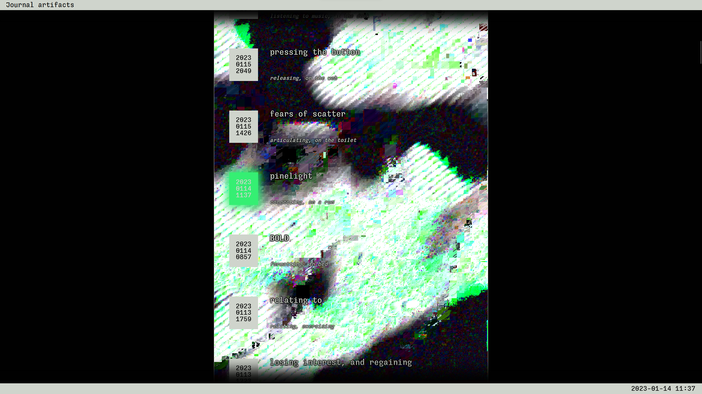

# JOURNAL ARTIFACTS
[live at palmdrop.github.io/artifacts](https://palmdrop.github.io/artifacts/)

This is an abstract micro-journal project. Short phrases, words, thoughts, whatever, jotted down by me in a document on my phone. The entries are intended to be vague, just memory prompts, a small little personal ritual.

The project is inspired by [still-here.net](https://still-here.net/), although I'm still unsure about the true purpose of the site.

[Read more on my site.](https://palmdrop.site/nodes/journal-artifacts?fullscreen=false)

# Tech
The site is built using [Svelte](https://svelte.dev/), and deployed on my [github page](https://palmdrop.github.io/artifacts/).

The data itself comes from a dropbox document that I edit manually or through some macros on my phone. I fetch the document data using a simple dropbox download link with read access.

To avoid exposing this link, I use a [serverless function from my main site](https://github.com/palmdrop/hypervivid/blob/main/functions/api/artifacts.js), which is deployed using cloudflare pages. The function reads the download link from the cloudflare key-value storage and processes the data.

The background animation is based on the [substrates](https://github.com/palmdrop/substrates) project. Each entry in the journal artifacts list corresponds to a specific point in the animation.